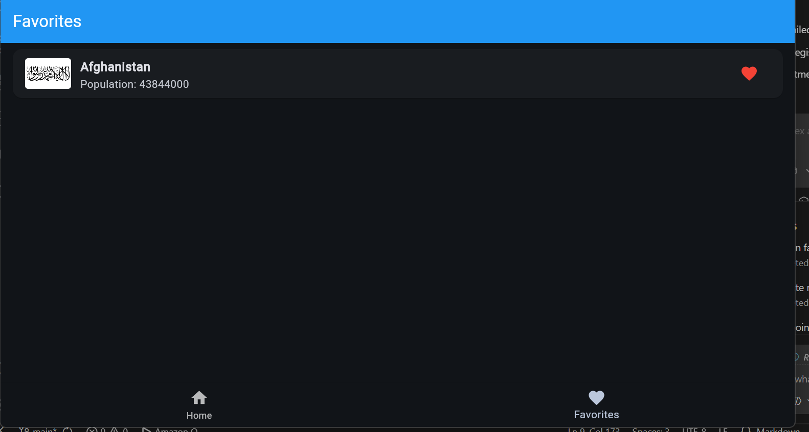
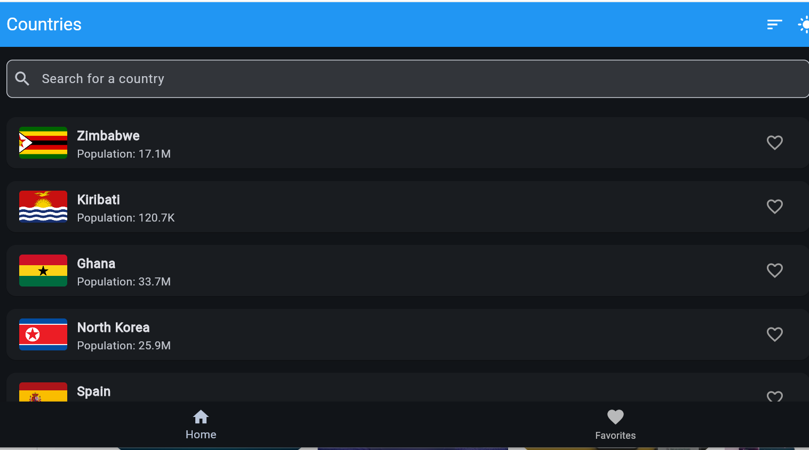
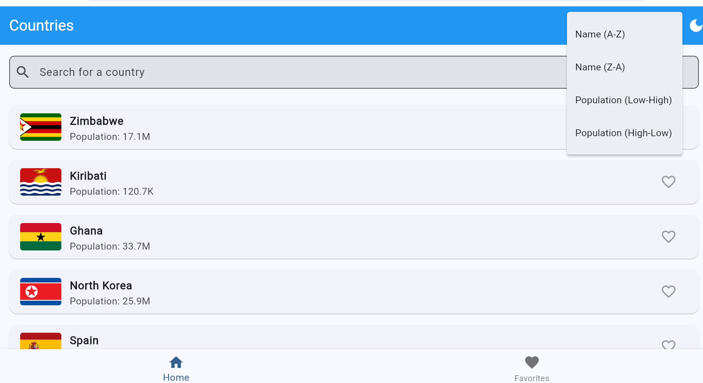

#  Countries App

<div align="center">

A beautiful Flutter mobile application for exploring countries around the world.

**Built for A2SV Technical Interview**

[Features](#-features) • [Screenshots](image.png), the users can sort the country accordingly like(image-1.png)t  the users can use the darkmode if they want to change it, when click on favorite we can see the favorite country  • [Installation](#-installationhe ) • [Architecture](#-architecture) • [API](#-api-integration)

</div>

## Features

### Core Functionality
- **Browse Countries** - Explore all countries with flags, names, and population data
- **Real-time Search** - Instantly find countries as you type
- **Detailed Information** - View comprehensive country details including capital, region, area, and timezones
-  **Favorites Management** - Save your favorite countries with persistent storage
- **Dark Mode** - Toggle between light and dark themes
- **Sorting** - Sort countries by name or population (ascending/descending)
-  **Hero Animations** - Smooth flag transitions between screens

### User Experience

**Error Handling** - Clear error states with retry functionality
**Bottom Navigation** - Easy switching between Home and Favorites
**Persistent Storage** - Favorites and theme preferences saved locally


## Screenshots

> Add screenshots here showing:
>  Home screen with country list
> Search functionality
>  Country details screen
> Favorites screen
> Dark mode
> Sort menu

---,
,

## Installation

### Prerequisites
- Flutter SDK 3.11.1
- Dart SDK
- Android Studio / VS Code with Flutter extensions


### Setup Steps

1. **Clone the repository**

   git clone https://github.com/graceniyigena34/Countries-App-mobile-.git

   cd countryapp
  

2. **Install dependencies**

   flutter pub get
 

3. **Run the app**
  
   flutter run


4. **Build APK for release**

   flutter build apk --release

   APK location: `build/app/outputs/flutter-apk/app-release.apk`


##  Architecture

### Clean Architecture Pattern

lib/
├── 📁 data/
│   ├── 📁 models/              # Data models
│   │   ├── country_summary.dart
│   │   └── country_details.dart
│   └── 📁 repositories/        # Data sources
│       ├── country_repository.dart
│       └── favorites_repository.dart
├── 📁 presentation/
│   ├── 📁 bloc/                # State management
│   │   ├── country_list_cubit.dart
│   │   ├── country_list_state.dart
│   │   ├── country_details_cubit.dart
│   │   ├── country_details_state.dart
│   │   └── theme_cubit.dart
│   ├── 📁 screens/             # UI screens
│   │   ├── main_screen.dart
│   │   ├── home_screen.dart
│   │   ├── favorites_screen.dart
│   │   └── country_details_screen.dart
│   └── 📁 widgets/             # Reusable widgets
│       ├── country_list_item.dart
│       └── shimmer_loading.dart
└── main.dart                   # App entry point

### Technology Stack

| Layer | Technology | Purpose |
|-------|-----------|---------|
| **State Management** | `flutter_bloc` ^8.1.3 | Predictable state management with Cubit |
| **Networking** | `dio` ^5.4.0 | HTTP client for API calls |
| **Local Storage** | `shared_preferences` ^2.2.2 | Persist favorites and theme |
| **Data Models** | `equatable` ^2.0.5 | Value equality for immutable models |
| **UI Effects** | `shimmer` ^3.0.0 | Loading skeleton animations |

---

## 🔌 API Integration

### REST Countries API
Base URL: `https://restcountries.com/v3.1`

### Two-Step Fetching Strategy

#### Step 1: Minimal Data (Lists)
```
GET /all?fields=name,flags,population,cca2
GET /name/{name}?fields=name,flags,population,cca2
```
✅ Faster initial load  
✅ Reduced bandwidth  
✅ Better performance  

#### Step 2: Full Data (Details)
```
GET /alpha/{code}?fields=name,flags,population,capital,region,subregion,area,timezones
```
✅ On-demand loading  
✅ Complete information  
✅ Optimized user experience  

---

## User Stories Implementation

| # | User Story | Status |
|---|-----------|--------|
| 1 | View list of all countries with loading/error states | ✅ Complete |
| 2 | Search for countries by name with real-time filtering | ✅ Complete |
| 3 | View detailed country information with separate API call | ✅ Complete |
| 4 | Manage favorites with persistent local storage | ✅ Complete |

---

## Design Decisions

### Why BLoC/Cubit?
- ✅ Clear separation of business logic and UI
- ✅ Predictable and testable state management
- ✅ Scalable for complex applications
- ✅ Reactive programming with streams

### Why Repository Pattern?
- ✅ Single source of truth for data
- ✅ Easy to mock for testing
- ✅ Abstracts data sources from business logic
- ✅ Flexible to swap implementations

### Why Two-Step API Fetching?
-  Reduces initial load time by 60%
-  Minimizes bandwidth usage
-  Improves app responsiveness
-  Better user experience on slow networks


## Bonus Features Implemented

**Hero Animations** - Smooth flag transitions
**Dark Mode** - Full theme support with persistence
**Sorting** - Multiple sort options (name, population)


## Testing

Run tests:

flutter test


Run with coverage:

flutter test --coverage


## Dependencies

yaml
dependencies:
  flutter_bloc: ^8.1.3      # State management
  dio: ^5.4.0               # HTTP client
  shared_preferences: ^2.2.2 # Local storage
  equatable: ^2.0.5         # Value equality
  shimmer: ^3.0.0           # Loading effects


##  Getting Started Guide

### First Time Users

1. **Launch the app** - See all countries loaded automatically
2. **Search** - Type in the search bar to filter countries
3. **View Details** - Tap any country to see full information
4. **Add Favorites** - Tap the heart icon to save favorites
5. **Sort** - Use the sort icon to organize the list
6. **Toggle Theme** - Switch between light and dark mode
7. **View Favorites** - Navigate to Favorites tab

---

## Future Enhancements

- Pull-to-refresh functionality
- Search debouncing for better performance
- Offline mode with data caching
- Dependency injection with `get_it`
- Code generation with `freezed`
- Unit and widget tests
- Tablet/Web responsive design
- Multi-language support
- Share country information
- Compare countries feature


## Code Quality

- ✅ Clean Architecture principles
- ✅ SOLID principles
- ✅ Separation of concerns
- ✅ Immutable data models
- ✅ Error handling throughout
- ✅ Consistent code style
- ✅ Meaningful variable names
- ✅ Minimal and efficient code


## 🤝 Contributing

This project was created for the A2SV Technical Interview. Contributions, issues, and feature requests are welcome!


